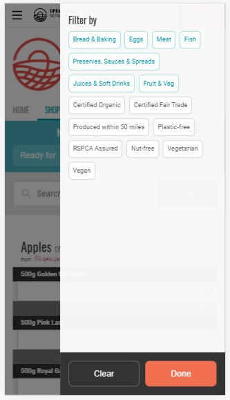

# Propiedades del producto

Puede aplicar las propiedades del producto a sus productos, como una forma de que sus clientes sepan más sobre cómo se producen sus productos y cuáles son sus características. Las propiedades actuales del producto que se pueden aplicar incluyen:

* Certificado orgánico / Comercio justo / Biodinámico
* Producido dentro de 15/30/50 millas
* RSPCA asegurado
* Crecido en Policultivos
* Sin gluten
* Sin nueces
* Sin plástico
* Libre de lácteos
* Requerimientos Dietéticos Especiales
* Vegano
* Vegetariano
* Oferta Especial
* Esquema de Cafetería Verde


Si desea aplicar una propiedad que no está en la lista anterior, póngase en contacto. Consideramos cualquier propiedad nueva que pueda tener un atractivo generalizado.


Hay dos formas de asignar propiedades a sus productos:

1\) Puede asignar una propiedad a una organización, de modo que todos los productos que pertenecen a esa organización llevarán esta propiedad \(a menos que se elimine manualmente, que se trata en la sección **"Propiedades Heredadas"** a continuación\).

2\) Puede asignar propiedades a productos particulares, de forma individual.

## Asignar una propiedad a una organización

Cuando asigna una propiedad a una organización, todos los productos que pertenecen a esa organización, por defecto, llevarán esa propiedad de producto. Por ejemplo, si todos sus productos son "Orgánicos Certificados", puede asignar esta propiedad a su empresa para evitar la necesidad de aplicar esta propiedad manualmente a todos los productos. Si una propiedad solo se aplica a algunos de sus productos, es mejor aplicarla al producto, en lugar de a la empresa \(instrucciones a continuación\).

Puede acceder a las propiedades de la organización en su [Configuración de Organización](../enterprise-profile/enterprise-settings.md): en su Panel de Administración, vaya a Organizaciones -&gt; Configuración -&gt; Propiedades


Las propiedades solo se aplican a los perfiles, tiendas y hubs/nodos de [Productor](../enterprise-profile/). Esta opción no estará disponible para Hubs/Nodos No Productores.


A continuación, hay 2 campos al aplicar una propiedad organizacional:

**Nombre de Propiedad**: Puede seleccionar una propiedad de producto predefinida de la lista desplegable. Este es el nombre de la propiedad con la que se etiquetarán sus productos y que los clientes podrán filtrar en su tienda.

**Descripción**: Puede agregar una pequeña descripción para brindar más información sobre su etiqueta. Por ejemplo, es posible que desee agregar un número de certificado.


Puede agregar tantas propiedades como desee a su organización.



No olvide guardar sus cambios haciendo clic en "Actualizar" en el cuadro rojo, abajo a la derecha.


## Asignar una propiedad a un producto

Para asignar una propiedad a un solo producto, en lugar de toda la gama de productos de una organización, haga clic en **Productos** en el banner azul horizontal y luego edite un producto existente \(no puede aplicar una propiedad de producto cuando crea un producto por primera vez\).

Para editar un producto, haga clic en el icono de edición \(lápiz y papel\) en el lado derecho de la tabla.

Una vez editado el producto, puede agregar o cambiar sus propiedades seleccionando 'Propiedades del Producto' en el menú de la derecha.

Hay 2 campos al aplicar una propiedad de producto:

**Nombre de Propiedad**: Puede seleccionar una propiedad de producto predefinida de la lista desplegable. Este es el nombre de la propiedad con la que se etiquetará su producto y que los clientes podrán filtrar en su tienda.

**Descripción**: puede agregar una pequeña descripción para brindar más información sobre su etiqueta. Por ejemplo, es posible que desee agregar un número de certificado.

Puede aplicar varias propiedades del producto haciendo clic en **"+Agregar Propiedades del Producto"**.


Recuerde hacer clic en **actualizar** cuando haya terminado.


## Propiedades Heredadas

Como se mencionó [anteriormente](product-properties.md#asignar-una-propiedad-a-una-organizacion), cuando a una empresa se le asigna una propiedad, todos los productos que pertenecen a esa empresa "heredarán" esta propiedad. Sin embargo, es posible anular esta herencia automática.

Al editar las propiedades de un producto, verá una casilla de verificación titulada **"Heredar propiedades de \(nombre de la organización\) \(A Menos que se Anule Arriba\)"**. De forma predeterminada, cuando una organización tiene una propiedad, esta casilla se marcará para todos los productos que pertenecen a la organización. Al desmarcar esta casilla, se eliminarán las propiedades organizacionales heredadas.


Si dejó la casilla marcada y agrega una propiedad al producto, que ya existe a nivel de organización, la descripción de la propiedad agregada a nivel de producto será preferible a la descripción a nivel de empresa.

Esto es útil si desea modificar solo la descripción de una etiqueta en productos seleccionados. \(Por ejemplo, si todos sus productos son 'orgánicos certificados', pero dos productos tienen un número de certificado diferente al resto, puede agregar el número de certificado principal a la descripción de la propiedad empresarial y el otro número a los dos productos que son diferentes usando estas descripciones de las propiedades del producto\).


## Ver Propiedades del Producto en la tienda en línea

Al hacer clic en el perfil de un productor, las Propiedades de la Organización aparecen en la página emergente:

Los clientes también pueden filtrar productos en una tienda en función de sus propiedades:

