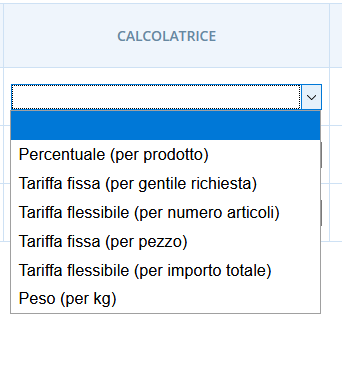

# Tariffe dell'Azienda

Le Tariffe aziendali sono utili per i produttori e gli hub che lavorano insieme: permette di collegare a soggetti differenti i costi di gestione di ciascuna fase \(amministrazione, confezionamento, trasporto, vendita, quote associative o di autofinanziamento\).

Per esempio, un hub potrebbe decidere di applicare una tariffa del 10% su tutti i prodotti che vende, per coprire i propri costi amministrativi \(immagazzinamento dei prodotti, salari di chi si occupa delle vendite, ecc.\)   
Per i produttori che si occupano autonomamente della vendita dei propri prodotti, questi costi sono già inclusi nel prezzo dei prodotti e dunque applicare queste tariffe potrebbe non essere necessario. 

Uno dei vantaggi di OFN per il consumatore è la trasparenza sul prezzo. Chi acquista può vedere la composizione del prezzo di ciascun prodotto. Questa informazione è visualizzabile cliccando nel grafico a torta accanto al prezzo di ciascun prodotto in vetrina: 

Prima di proseguire, puoi dare un'occhiata a questa rapida dimostrazione su come impostare la tua prima tariffa aziendale: 

## Impostare una Tariffa dell'Azienda

* Vai alla pagina Tariffe dell'Azienda, cliccando su **Aziende** nel menù blu orizzontale e poi su **Impostazioni** accanto al nome della tua azienda. La pagina delle **Tariffe dell'Azienda** si trova quindi nel menù a sinistra. 
* Clicca su **Creane una ora -&gt;** \(o **Gestisci Tariffe dell'Azienda**, se ne hai già creata una e intendi modificarla\). Sarai re-diretto ad una pagina come questa:  

**Azienda:** Nella prima colonna, seleziona l'azienda a cui applicare la tariffa. 

**Tipo Tariffa:** Seleziona il servizio a cui è collegata la tariffa. Le opzioni sono: Tariffa imballaggio, Tariffa trasporto, Contributo amministrativo, Commissione di vendita o Contributo Raccolta Fondi. .

**Nome:** Scegli un nome per questa tariffa. ****

**Categoria d'imposta:** Seleziona la categoria appropriata. Nella maggiorparte dei casi l'IVA della tariffa sarà ereditata dal prodotto. Se la tariffa è associata ad un servizio aggiunto al prodotto, la tariffa potrebbe essere soggetta ad un IVA differente. \[If the enterprise fee is associated with a service added to the product the fee may be subject to VAT but the product itself not. In which case choose between 'Zero rated', 'Full Rate' and 'Reduced Rate' of VAT to applied to Enterprise fees.\]

**Calcolatore:** La tariffa può essere calcolata in diversi modi. Seleziona il tipo di calcolatore adatto. ****

Clicca su **Aggiorna** per creare la tariffa.


Potrai specificare le percentuali o i valori della calcolatrice \(nella colonna "Valori della calcolatrice"\) solo dopo aver creato la Tariffa dell'Azienda. 


## Calcolatori della Tariffa

**Percentuale fissa** – This fee is charged as a percentage of the total amount charged in the order.

**Weight \(per kg\)** – this fee is applied to products on a per kg basis. The fee will _only be applied to products which are priced at a per kg rate_, not products listed as items \(e.g. A product listed as ‘1 bunch of parsley’ will not have an associated enterprise fee with this option.\)

**Flat Rate \(per order\)** – This fee is applied as standard fee to all orders, regardless of the size of the order.

**Flexible Rate** – This fee calculator is especially useful if you'd like to encourage customers to place large orders: the enterprise can be reduced or zero when the threshold number of items has been reached. 

* ‘First Item Cost’: The fee charged for the first item in the order.
* ‘Additional Item Cost’: The fee charged for items beyond the first item.
* ‘Max Items’: The maximum number of items on which the fee will be applied. Items purchased beyond this amount will be not be charged the fee.

> For Example: if the 'First Item Cost' is set to £0.20, 'Additional Item Cost' is £0.10 and 'Max Items' is 3 then a customer who purchases 5 items will be charged £0.40 in enterprise fees \(£0.20 for the first item, £0.10 for items two and three, and £0.00 for items four and five\).

**Flat Rate \(per item\):** This fee is a constant fee, applied to products listed as ‘items’. \(It is not applied to products sold by weight or volume. Hence there will be no associated enterprise fee charged to a customer who, for example, buys rice by kg.\)

**Price Sack:** This is a flexible enterprise fee method charged by _total monetary sale_, rather than number of items purchased \(Flexible Rate above\)

* ‘Minimum Amount’: Monetary value of the threshold between Normal Enterprise fee and Discounted Enterprise fee. 
* 'Normal Amount': Payment Method fee applied to sales below the threshold stated in 'Minimum Amount'.
* ‘Discount Amount’: Payment Method fee applied to sales above the threshold stated in 'Minimum Amount'.


Now that you've created your Enterprise Fee remember that **it will not apply in your shop unless it's added to an order cycle**. See the order cycle pages for [producers](order-cycle/order-cycles-for-producers.md) or [hubs ](order-cycle/order-cycles-for-hubs.md)for more details.


